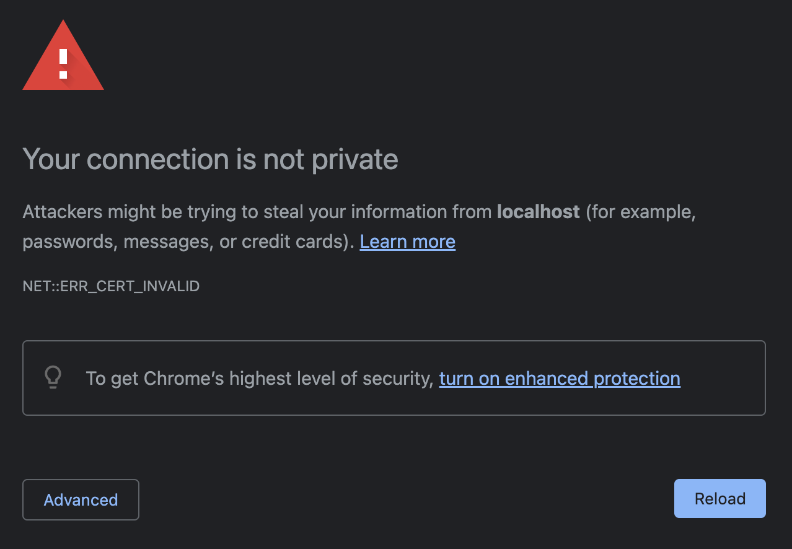
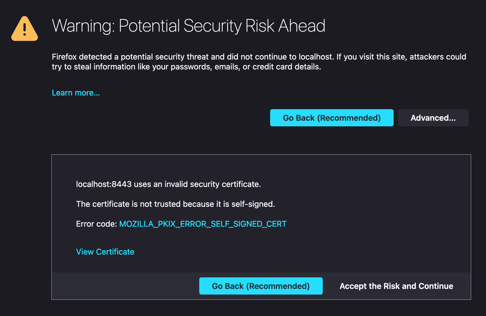

# Serving React with Express using HTTPS on localhost

This is a demonstration of serving a React app over HTTPS using Express. Don't use this security pattern in production. The SSL certificate, encrypted key, decrypted key, and passphrase are included in this repository, but should not be for real applications.

## Installation

Clone the repository and install the dependencies in `./backend` and `./frontend` by running `npm i` in each directory.

## Create a build

Run `./build.sh`. This script will use the `build` script from `create-react-app` to create a production build of a React app and then copy it into the `./backend/public` folder where it will be served from.

## Generate your own SSL certificate and key

The included SSL certificate, keys, and passphrase were generated using OpenSSL. These should allow the application to run without any manual effort. If you wish, you can use the instructions below to generate your own files.

- Ensure OpenSSL is installed: `which openssl`

  - If it is not, install it with Homebrew: `brew install openssl`

- In the backend directory (`./backend`), run the following to create your certificate (`cert.pem`) and encrypted key (`keytmp.pem`):

  ```
  openssl req -x509 -newkey rsa:2048 -keyout keytmp.pem -out cert.pem -days 365
  ```

  - You will be asked to enter a PEM pass phrase, which you should save into the `PASSPHRASE` environment variable in `./backend/.env`.

- Use the encrypted key to generate a decrypted key (`key.pem`). Enter your passphrase when prompted:

  ```
  openssl rsa -in keytmp.pem -out key.pem
  ```

## Run

`cd backend` and `npm run start:dev` to run the application. Express will listen on `8080` for `http` requests, and `8443` for `https` requests. Requests for the HTTP version of resources are upgraded to HTTPS. Check this out by visiting http://localhost:8080 and watch the redirection to https://localhost:8443.

## A note on local development using this code

Modern browsers view self-signed certificates with suspicion, as this has been a common attack vector in the past.

Chrome presents a `NET::ERR_CERT_INVALID` warning:



Firefox presents a `MOZILLA_PKIX_ERROR_SELF_SIGNED_CERT` warning:


